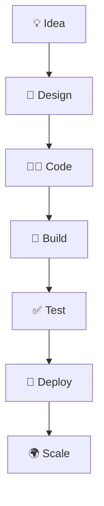

<div align="center">

# 🌱 SPRING BOOT PROJECT


<br>


</div>

---

## 🚀 About The Project

This repository contains a **Spring Boot Application** built using modern Java development practices.

✨ Features:

- ⚡ Fast and production-ready Spring Boot setup
- 🔗 REST API development
- 📦 Maven dependency management
- 🏗️ Scalable project architecture
- 🔄 Easy integration with databases and frontend applications
- ☁️ Deployment-ready structure

---

## 🌿 Tech Stack

<div align="center">

| Technology | Purpose |
|------------|----------|
| ☕ Java | Core Programming Language |
| 🌱 Spring Boot | Backend Framework |
| 📦 Maven | Build Tool |
| 🔀 Git | Version Control |
| 🐙 GitHub | Repository Hosting |

</div>

 # 🌟 Development Lifecycle

<div align="center">



</div>

---


<div align="center">

### 🛤️ Learning Journey

```text
┌─────────────┐
│ 🌱 LEARN    │
└──────┬──────┘
       ▼
┌─────────────┐
│ 💻 BUILD    │
└──────┬──────┘
       ▼
┌─────────────┐
│ 🧪 TEST     │
└──────┬──────┘
       ▼
┌─────────────┐
│ 🚀 DEPLOY   │
└──────┬──────┘
       ▼
┌─────────────┐
│ 🌍 SCALE    │
└─────────────┘
```

</div>

---

<div align="center">

### 💚 Spring Boot Philosophy

```text
Code Less ⚡
     │
     ▼
Build Faster 🚀
     │
     ▼
Deploy Smarter ☁️
     │
     ▼
Scale Bigger 🌍
```

</div>

---

# 🎯 Project Goals

<div align="center">

| 🎯 Goal | 🚀 Mission |
|----------|-----------|
| 🌱 Learn Spring Boot | Master modern Java backend development |
| 🔗 Build APIs | Create scalable RESTful services |
| 🏗️ Backend Architecture | Understand enterprise application design |
| ✨ Clean Code | Follow industry-standard coding practices |
| 🚀 Modern Development | Explore real-world Spring ecosystem |

</div>

---
